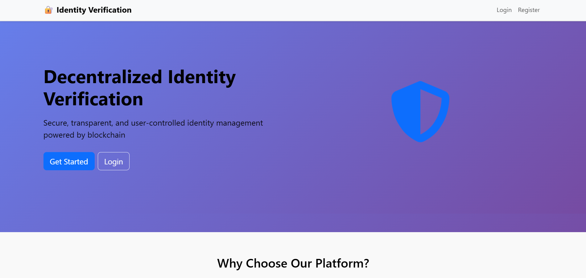
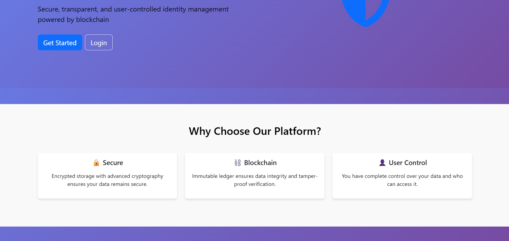
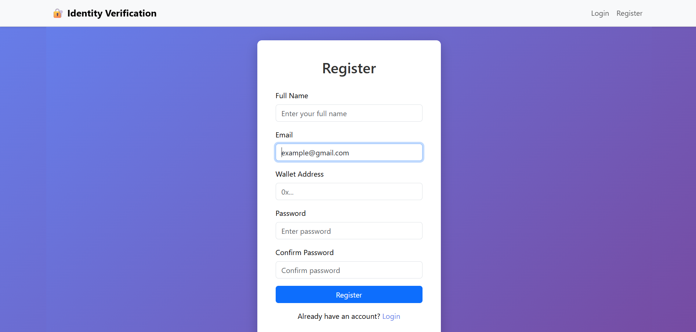
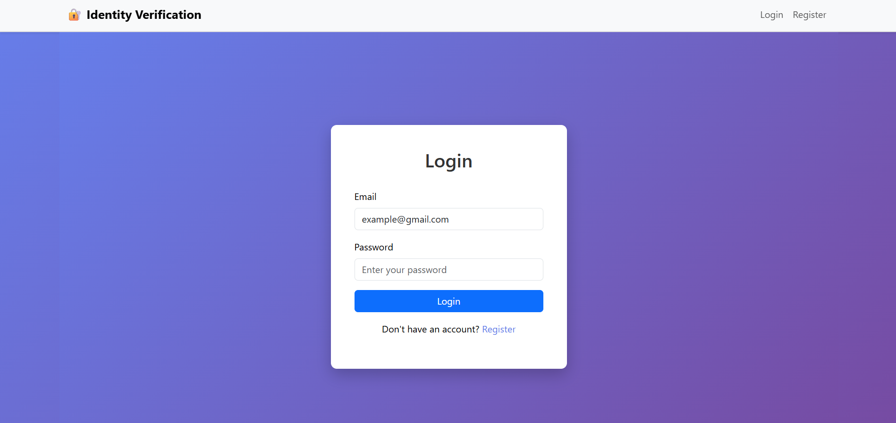
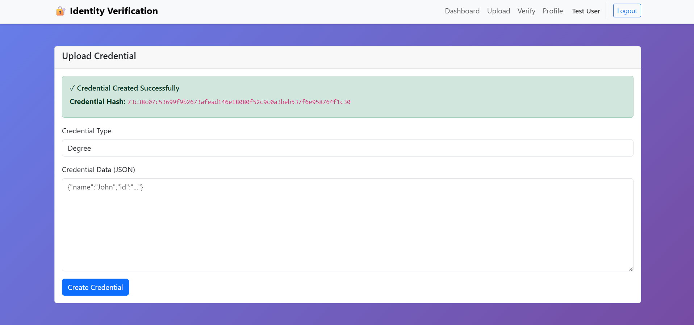
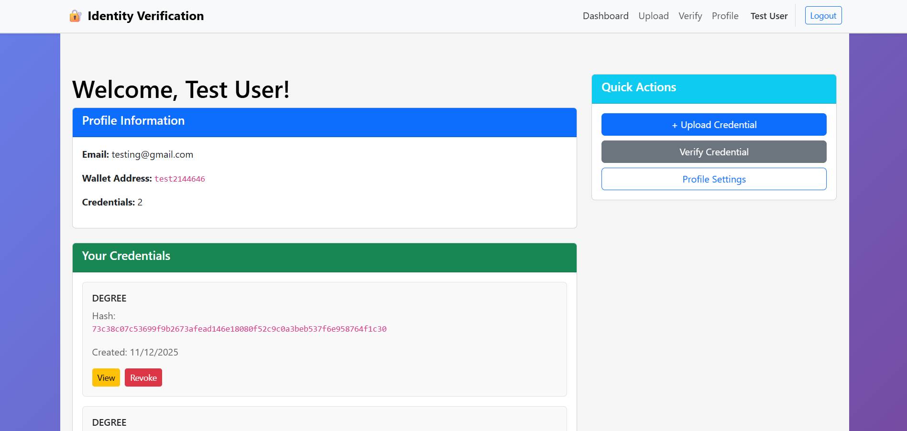

# Decentralized Identity Verification System

A blockchain-based identity verification platform that ensures secure, tamper-proof, and user-controlled identity management using Ethereum smart contracts and MongoDB.

## 📋 Project Overview

This system provides:
- **Secure Identity Storage**: Encrypted storage of identity credentials
- **Blockchain Verification**: Immutable ledger for credential verification
- **User Control**: Complete control over personal data and sharing permissions
- **Decentralized Architecture**: No single point of failure or centralized authority
- **Multi-sector Application**: Banking, e-governance, healthcare, educational institutions

## 🏗️ Architecture

### Technology Stack

**Backend**
- Python 3.10+
- Flask/Flask-CORS
- MongoDB (off-chain storage)
- Web3.py (Ethereum interaction)

**Frontend**
- React 18+
- React Router
- Bootstrap 5
- Axios
- Web3.js / Ethers.js

**Blockchain**
- Solidity Smart Contracts
- Ethereum / Ganache (local testing)
- MetaMask/Coinbase Wallet

**Infrastructure**
- MongoDB (Database)
- Ganache (Local Blockchain)
- AWS/Azure/GCP (Production)

## 📦 Project Structure

```
is-project/
├── backend/
│   ├── app/
│   │   ├── models/
│   │   │   ├── database.py
│   │   │   └── __init__.py (User, Credential models)
│   │   ├── routes/
│   │   │   ├── auth_routes.py
│   │   │   ├── credential_routes.py
│   │   │   ├── user_routes.py
│   │   │   └── __init__.py
│   │   ├── utils/
│   │   │   ├── auth.py
│   │   │   ├── encryption.py
│   │   │   ├── blockchain.py
│   │   │   └── __init__.py
│   │   └── __init__.py
│   ├── run.py (Flask app entry point)
│   ├── requirements.txt
│   └── .env.example
├── frontend/
│   ├── src/
│   │   ├── components/
│   │   │   ├── Home.js
│   │   │   ├── Login.js
│   │   │   ├── Register.js
│   │   │   ├── Dashboard.js
│   │   │   └── Auth.css / Home.css / Dashboard.css
│   │   ├── services/
│   │   │   ├── api.js
│   │   │   └── authService.js
│   │   ├── App.js
│   │   ├── index.js
│   │   └── App.css
│   ├── public/
│   │   └── index.html
│   └── package.json
└── smart-contracts/
    └── IdentityVerification.sol
```

## 🚀 Getting Started

### Prerequisites

- Python 3.10+
- Node.js 16+
- MongoDB (local or Atlas)
- Ganache CLI or local Ethereum node
- Git

### Backend Setup

1. **Install Python dependencies**
   ```bash
   cd backend
   pip install -r requirements.txt
   ```

2. **Configure environment variables**
   ```bash
   cp .env.example .env
   ```
   
   Update `.env` with your configuration:
   ```
   MONGODB_URI=mongodb://localhost:27017
   DB_NAME=identity_verification
   WEB3_PROVIDER_URI=http://127.0.0.1:8545
   JWT_SECRET=your-secret-key
   SECRET_KEY=your-flask-secret
   ```

3. **Start MongoDB**
   ```bash
   # Using Docker
   docker run -d -p 27017:27017 --name mongodb mongo
   
   # Or use local MongoDB installation
   mongod
   ```

4. **Run Flask server**
   ```bash
   python run.py
   ```
   
   Server will run on `http://localhost:5000`

### Frontend Setup

1. **Install dependencies**
   ```bash
   cd frontend
   npm install
   ```

2. **Configure API endpoint**
   
   Create `.env` file in frontend root:
   ```
   REACT_APP_API_URL=http://localhost:5000/api
   ```

3. **Start development server**
   ```bash
   npm start
   ```
   
   App will run on `http://localhost:3000`

### Smart Contract Setup

1. **Install Ganache CLI**
   ```bash
   npm install -g ganache-cli
   ```

2. **Start local blockchain**
   ```bash
   ganache-cli
   ```

3. **Compile and deploy contract**
   
   Using Hardhat or Truffle:
   ```bash
   # Copy IdentityVerification.sol to your project
   npx hardhat compile
   npx hardhat run scripts/deploy.js --network ganache
   ```

4. **Update contract address**
   
   Update the `CONTRACT_ADDRESS` in backend `.env` with deployed contract address

## 📡 API Endpoints

### Authentication Routes

- **POST** `/api/auth/register` - Register new user
  ```json
  {
    "email": "user@example.com",
    "password": "password123",
    "wallet_address": "0x...",
    "full_name": "John Doe"
  }
  ```

- **POST** `/api/auth/login` - Login user
  ```json
  {
    "email": "user@example.com",
    "password": "password123"
  }
  ```

### User Routes

- **GET** `/api/users/profile` - Get user profile (requires auth)
- **PUT** `/api/users/profile` - Update user profile (requires auth)
- **POST** `/api/users/verify/<user_id>` - Verify user (admin)

### Credential Routes

- **POST** `/api/credentials/create` - Create new credential (requires auth)
  ```json
  {
    "credential_type": "passport",
    "credential_data": { "number": "...", "expiry": "..." }
  }
  ```

- **GET** `/api/credentials/list` - List all credentials (requires auth)
- **GET** `/api/credentials/<credential_id>` - Get credential details (requires auth)
- **POST** `/api/credentials/<credential_id>/revoke` - Revoke credential (requires auth)
- **GET** `/api/credentials/verify/<credential_hash>` - Verify credential (public)

## 🔐 Security Features

### Encryption
- Fernet symmetric encryption for sensitive data
- AES-256 encryption standard
- Per-credential encryption keys

### Hashing
- SHA-256 hashing for credential data
- Merkle root hash for batch verification
- Blockchain-immutable hash storage

### Authentication
- JWT token-based authentication
- Bcrypt password hashing
- Token expiration (24 hours by default)

### Database Security
- MongoDB indexes on sensitive fields
- Unique constraints on email and wallet address
- Access control through user ownership verification

## 🔗 Smart Contract Functions

### Core Functions

1. **storeCredential**
   - Store credential hash on blockchain
   - Parameters: user address, credential hash, credential type
   - Events: CredentialStored

2. **verifyCredential**
   - Verify credential validity
   - Parameters: user address, credential hash
   - Returns: boolean (valid/invalid)

3. **revokeCredential**
   - Revoke a credential
   - Parameters: user address, credential hash
   - Events: CredentialRevoked

4. **getCredential**
   - Retrieve credential details
   - Parameters: user address, credential hash
   - Returns: credential data tuple

## 📊 Database Schema

### Users Collection
```javascript
{
  _id: ObjectId,
  email: String (unique),
  wallet_address: String (unique),
  full_name: String,
  password_hash: String,
  is_verified: Boolean,
  credentials: Array,
  verification_count: Number,
  created_at: Date,
  updated_at: Date
}
```

### Credentials Collection
```javascript
{
  _id: ObjectId,
  user_id: ObjectId,
  credential_type: String,
  data: {
    encrypted_data: String,
    encryption_key: String
  },
  blockchain_hash: String,
  blockchain_timestamp: Date,
  is_active: Boolean,
  access_count: Number,
  created_at: Date,
  updated_at: Date
}
```

## 🧪 Testing

### Backend Tests
```bash
cd backend
python -m pytest tests/
```

### Frontend Tests
```bash
cd frontend
npm test
```

### Smart Contract Tests
```bash
npx hardhat test
```

## 📝 Example Workflows

### User Registration & Login
1. User registers with email, password, wallet address
2. Backend hashes password and stores user in MongoDB
3. JWT token generated and returned
4. User logs in with credentials
5. Token stored in browser localStorage

### Credential Upload
1. User uploads credential (passport, Aadhar, etc.)
2. Backend encrypts credential data
3. Hash of credential generated
4. Hash stored on blockchain via smart contract
5. Encrypted data stored in MongoDB with metadata
6. User receives blockchain transaction hash

### Credential Verification
1. Verifier requests credential verification
2. Backend retrieves credential from MongoDB
3. Blockchain hash verified for integrity
4. Credential validity confirmed via smart contract
5. Response sent to verifier (only if authorized)

## 🚀 Deployment

### Docker Deployment

1. **Create Dockerfile for backend**
   ```dockerfile
   FROM python:3.10
   WORKDIR /app
   COPY requirements.txt .
   RUN pip install -r requirements.txt
   COPY . .
   CMD ["python", "run.py"]
   ```

2. **Build and run**
   ```bash
   docker build -t identity-verification .
   docker run -p 5000:5000 --env-file .env identity-verification
   ```

### Cloud Deployment (AWS)

1. **Deploy backend on EC2/ECS**
   - Use Gunicorn as WSGI server
   - Configure Nginx as reverse proxy
   - Use RDS for MongoDB Atlas
   - Set up SSL/TLS certificates

2. **Deploy frontend on S3 + CloudFront**
   - Build React app: `npm run build`
   - Upload to S3 bucket
   - Configure CloudFront for CDN

3. **Connect to blockchain**
   - Use Infura or Alchemy for Ethereum
   - Contract deployed on Ethereum mainnet/testnet

## Images Included

The repository includes the following images located in the `images/` folder:








## 📚 Additional Resources

- [Flask Documentation](https://flask.palletsprojects.com/)
- [Web3.py Documentation](https://web3py.readthedocs.io/)
- [React Documentation](https://react.dev/)
- [Solidity Documentation](https://docs.soliditylang.org/)
- [MongoDB Documentation](https://docs.mongodb.com/)
- [Ethereum Documentation](https://ethereum.org/developers)

## 🤝 Contributing

1. Fork the repository
2. Create a feature branch
3. Make your changes
4. Submit a pull request

## 📄 License

This project is licensed under the MIT License.

## ⚠️ Important Notes

1. **Security**: Never commit `.env` file with real credentials
2. **Blockchain**: Use testnet for development (Ganache, Goerli, Sepolia)
3. **API Keys**: Store sensitive keys in environment variables
4. **CORS**: Configure CORS appropriately for production
5. **SSL/TLS**: Use HTTPS in production

## 🆘 Troubleshooting

### MongoDB Connection Issues
- Ensure MongoDB is running on port 27017
- Check `MONGODB_URI` in `.env`
- Verify firewall settings

### Blockchain Connection Issues
- Ensure Ganache is running on port 8545
- Check `WEB3_PROVIDER_URI` in `.env`
- Verify contract is deployed

### CORS Issues
- Add correct frontend origin to CORS configuration
- Check browser console for detailed errors

---

**Last Updated**: November 12, 2025
